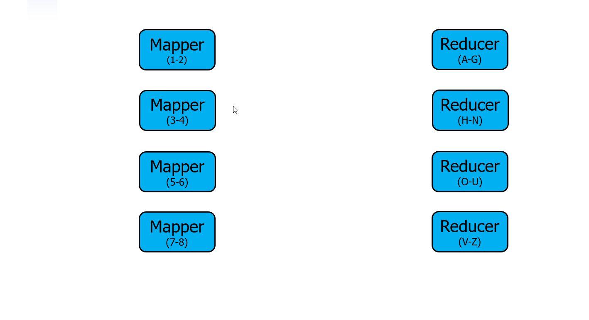
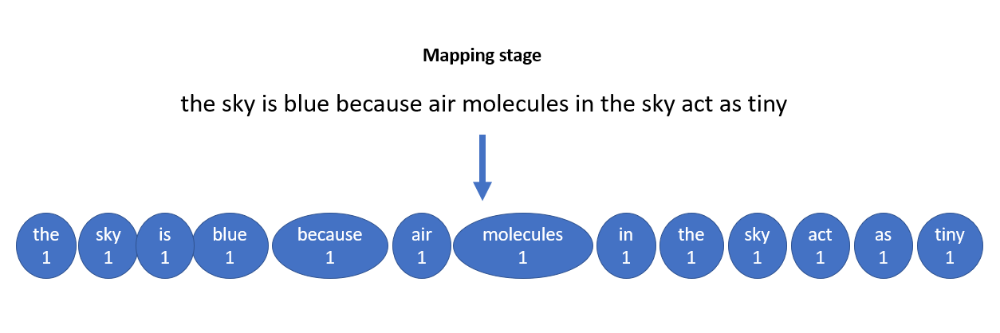
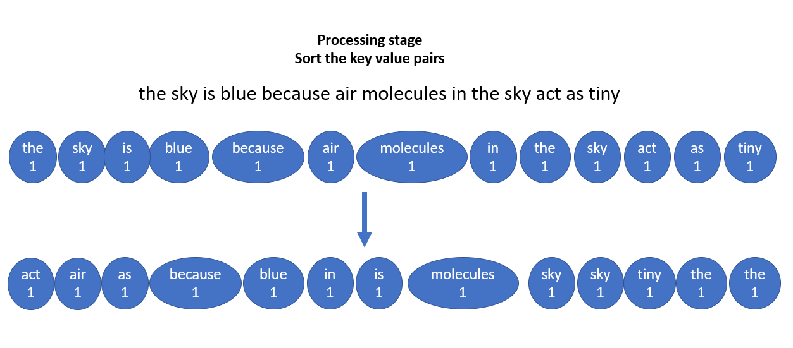
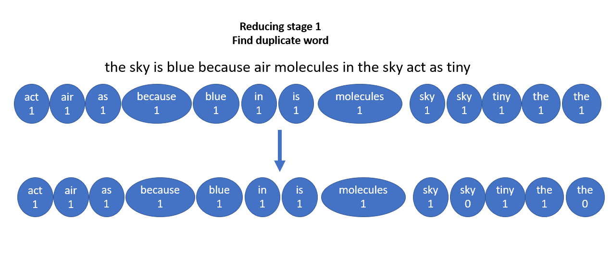
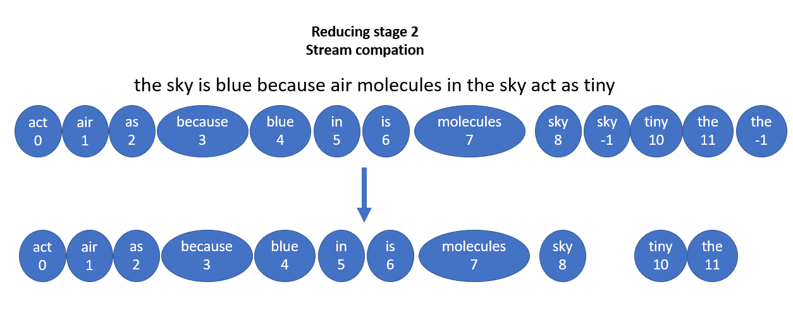
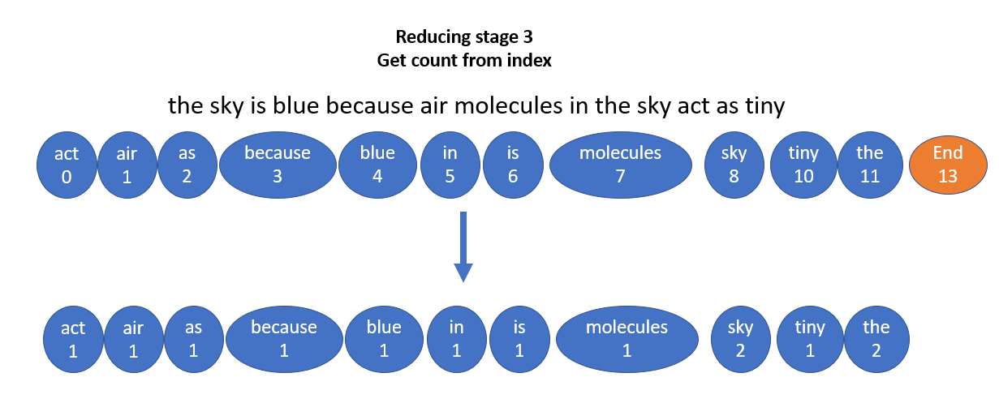
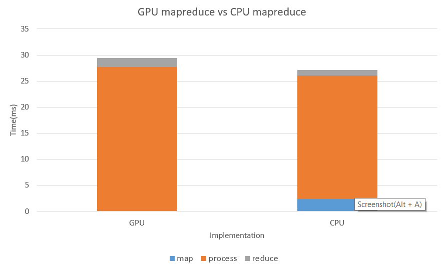
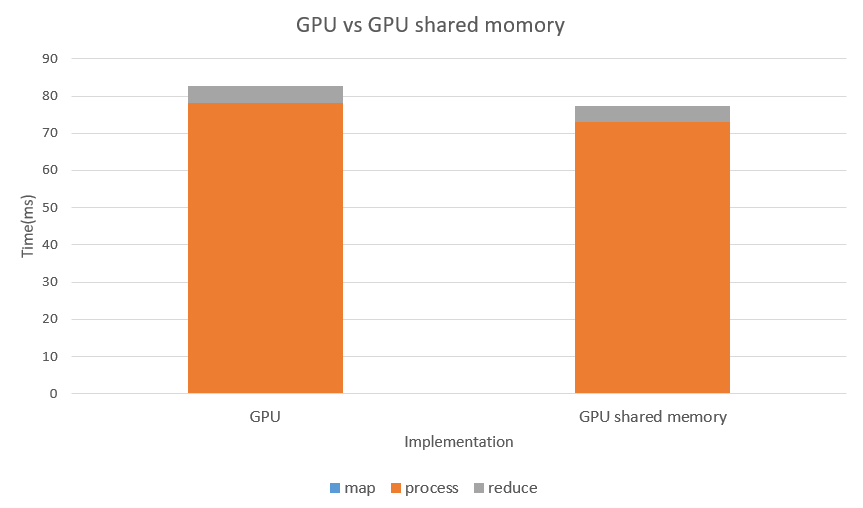

Distributed map reduce with GPU acceleration
======================
**Authors:** Edward Atter, Siyu Zheng, Yan Wu

## Overview
Map reduce is an important algorithm in the age of big data. It serves as a template, allowing other programmers to efficiently build a program capable of processing enourmous amounts of data using the power of distriuted computing. The basic example is word count, but it's applications expand much further to other well known algorithms such as Google's PageRank and friend recommendation systems. 

Traditionally, this is accomplished on a CPU using software such as Hadoop. To achieve true paralellism, thousands of computers are often used together in a cluster. By utilizing the native paralellism present in GPU architecture, we theorize many less computers can be clustered together to yield the same performance; resulting in a much better performance per dollar. 

A quote from NetworkWorld about distributed MapReduce on a GPU explains, "most of [the frameworks] are no longer supported and were built for particular scientific projects." This is the need we hope to fulfill.

## Usage

Single, memory mode:

    ./MapReduce input_file.txt

For distributed mode, create a txt file in the format `ip_address port` like the following:

    192.168.0.2 1337 
    192.168.0.3 1337
    192.168.0.4 1337

The slave script should be invoked on each node. Finally, the provided bash script will launch the MapReduce program for all nodes.

## WordCount Example

### Process
 
1. Read the input file line by line to the files_keyvaluepair, key is the line number and value is all character of this line.
2. Mapping stage, predefine a emit number for each line as the largest number of words in a line, create a map_keyvaluepair array with length as emits per line times maximum number of line. Then read each files_keyvaluepair, parse it in to different words, and set correspoding map_keyvaluepair key as the word, and value as one.

 

3. Processing map_keyvaluepair before reduce stage, sort the array of map_keyvaluepair to put all pairs with same key together.

 

4. Reducing stage, find all keyvaluepair has different key as the previous one, and store its index, create reduce_keyvaluepair, the key is the word, the value is the index minus the index of previous index, which is just the count of this word.

 
 
 

### CPU Implementation

1. Predifined the maximum number of total words in this file, usd for loop in both map and reduce stages to do all the mapping and comparison.
2. Used std::sort in pocessing the key value pairs.
3. Used C Library String.h for string function.

### GPU Implementation

1. Created threads for mapping and reducing. Each thread is account for a keyvaluepair.

2. In processing stage, used thrust library to do stream compaction and sorting. The stream compaction is to remove all keyvaluepairs with the word as empty which is caused by strtok or predefined line max emits. By doing this we save a lot of time working on meanless pairs.

3. Divided reducing stage into three parts: First find the word of keyvaluepair which is different from the previous one, and create new keyvaluepair with word and index in a preallocated array. Then use stream compaction to remove all keyvaluepair which is not assigned with a index. Last, I calculated the difference of adjacent keyvaluepair to get the count for each word.

4. Used two kinds of keyvaluepair, one with key and value are both char array for reading from input files. Then used keyvaluepair with key as char array and value as int for index and counting, which can save some time for strcpy.

5. std::String and String.h is not usable in CUDA, so I have to implemented all the string function such as strlen, strcmp and so on. For normal strtok, it uses a static variable and doesn't support multithreading. I implemented strtok_r instead.

## Performance Analysis

* Tested on: Windows 10, i7-8750 @ 2.20GHz 16GB, GTX 1060 6GB, Visual Studio 2015, CUDA 8.0(Personal Laptop)

File line num: 700

|Time (ms) | GPU       | CPU           |
| ---------|:---------:|:-------------:|
|Map   | 0.047     | 2.333 |
|Process| 27.646 | 23.699 |
|Reduce | 1.712  | 1.100   |

  

File line num: 4500

|Time (ms) | GPU       | GPU shared memory           |
| ---------|:---------:|:-------------:|
|Map   | 0.040   | 0.040 |
|Process| 78.176 | 73.015 |
|Reduce | 4.459  | 4.338   |

  
